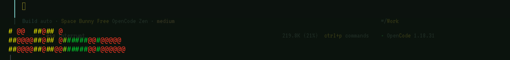

> **Support this project:** I live on less than $12,000 a year and build
> everything here myself — no school, no funding. Most of anything
> donated goes to accessibility hardware I can't afford (a refreshable
> braille display and reading devices). Cash App: `$ugenight7`
>
> Not a handout. Just a thank-you.

---

# Open Road

Offline speech and dictation for [opencode](https://opencode.ai) on Wayland.

Push-to-talk dictation with a live green/yellow/red spectrum analyzer, and
text-to-speech that reads your clipboard aloud. Everything runs locally —
no API keys, no network, no credits.



## What this is

Two halves that work together:

- **Dictation** — press one key, talk, press it again. A live spectrum
  analyzer shows your voice level across the frequency range, colored green
  at quiet levels, yellow in the middle, and red on peaks. The transcript is
  transcribed locally and pasted straight into whatever window you were
  typing in.
- **Text to speech** — copy some text, press one key, and a local neural
  voice reads it aloud. Press again to cut it off mid-sentence.

Transcription is handled by [ostt](https://github.com/ostt-speech/ostt)
using a local whisper.cpp model. This project replaces only the recorder
front-end, because the stock one draws its spectrum in the terminal's
default foreground color with no way to change it.

## Features

- Fully offline. Piper for speech, whisper.cpp `base` for dictation.
- Live 40 Hz – 12 kHz spectrum, 5 rows tall, full terminal width, pinned to
  the bottom of the screen.
- Level-driven color: green → yellow → red, with peak-hold markers.
- Auto-paste into the previously focused window, no extra keypress.
- Ascii-only rendering, so it looks correct in any font, including
  dot-matrix faces like VT323.
- Explicit sink and source selection, so a USB soundcard cannot silently
  swallow your audio.
- No error dialogs. A silent recording just says so.

## Requirements

| Dependency | Purpose |
|---|---|
| `piper-tts` | speech synthesis (in a Python venv, uses numpy) |
| `ostt` | local whisper.cpp transcription |
| `pw-record`, `pw-play` | PipeWire capture and playback |
| `pactl` | PipeWire control |
| `ffmpeg` | audio format conversion |
| `wtype` | present but unused; see [docs/TROUBLESHOOTING.md](docs/TROUBLESHOOTING.md) |
| Hyprland | popup window and the auto-paste watcher |
| Ghostty | hosts the analyzer popup |

A Python virtualenv containing `numpy` and `piper` is required for the
recorder. `scripts/speak.sh` expects it at `~/.local/opencode-assist`.

## Install

```bash
git clone https://github.com/seanskee777/open-road.git
cd open-road
./install.sh
```

The installer copies the scripts, drops the config files in place, and
prints the keybinding lines you need to add. It does not touch your
Hyprland config automatically — see below.

## Keybindings

Add these to your Hyprland `bindings.lua` (or reference the copy in
`config/hypr-bindings.lua`):

```lua
o.bind("ALT + SPACE", "Dictate (spectrum)", "'$HOME/.local/bin/ostt-viz-launch'")
o.bind("SUPER + SHIFT + V", "TTS read aloud", "'$HOME/.local/opencode-assist/speak.sh'")
```

| Key | Action |
|---|---|
| `Alt+Space` | start dictation, press again to finish and paste |
| `Enter` | finish dictation from inside the popup |
| `Esc` or `q` | cancel dictation and discard the recording |
| `Space` | pause and resume while recording |
| `Super+Shift+V` | read the clipboard aloud |
| `Super+Shift+V` again | stop playback mid-sentence |

> **Do not bind TTS to `Ctrl+Super+V`.** That chord is already owned by
> omarchy's clipboard manager and both resolve to the same modifier mask, so
> the clipboard manager wins and the key does nothing.

Reload Hyprland with `hyprctl reload` after editing bindings.

## Auto-paste

Keystroke injection into other Wayland applications is not possible from a
normal process on this setup — the compositor exposes no virtual-keyboard
protocol, so `wtype` silently does nothing. The paste is therefore
dispatched from inside the Hyprland config, where it does work:

1. The recorder restores focus to your previous window once its popup is
   gone, then writes a flag file.
2. A watcher in `bindings.lua` claims that flag and sends `Ctrl+V` (or
   `Shift+Insert` when the target is a terminal) via Hyprland's own
   `send_key_state` dispatcher.

That is why the binding file contains Lua rather than a plain shell command.

## Configuration

| File | Purpose |
|---|---|
| `config/ostt.toml` | transcription provider, model, audio device |
| `config/opencode.json` | opencode config (model, providers) |
| `config/AGENTS.md` | global agent instructions, loaded every session |
| `config/hypr-bindings.lua` | reference copy of the working bindings |
| `plugin/dyslexia.ts` | opencode plugin exposing the speech tools in-session |

Inside opencode you also have four tools: read text aloud, listen to the
microphone, toggle auto read-aloud, and open a captioned listen-and-read
player.

## Documentation

- [docs/SETUP.md](docs/SETUP.md) — dependencies, voices, audio device selection
- [docs/KEYBINDS.md](docs/KEYBINDS.md) — every binding, and how to add your own
- [docs/ARCHITECTURE.md](docs/ARCHITECTURE.md) — how the pieces fit together
- [docs/TROUBLESHOOTING.md](docs/TROUBLESHOOTING.md) — the problems actually hit

## Privacy

Nothing leaves the machine. There are no API keys in this repository and
none are needed at runtime.

## License

MIT
